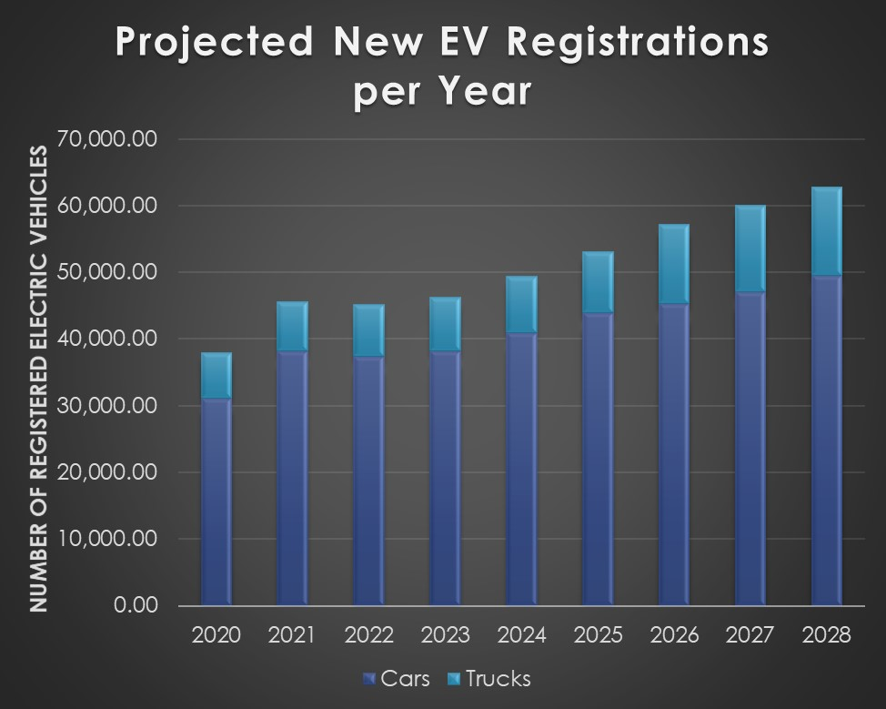
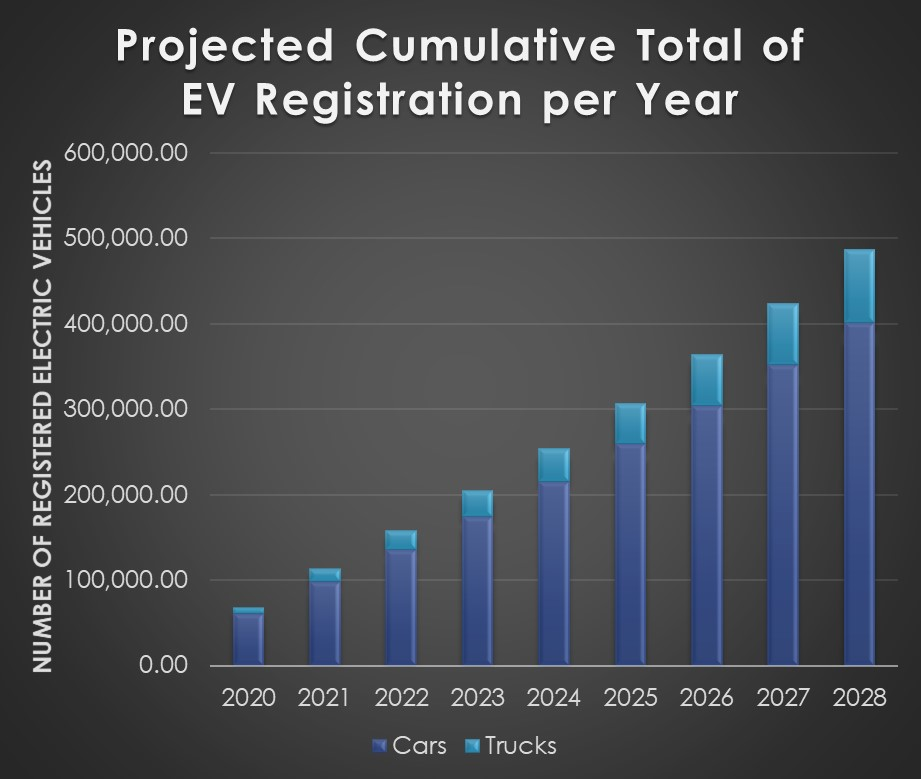

<h1>Electrical Vehicle Charging Stations Coverage in Travis County, Texas</h1>

---

<h2>Introduction</h2>
<ul>
  <li>In recent times, discussion about climate change and its effects have become more pronounced. Policy makers and industry leaders alike have responded by legislating regulations that seek to gradually limit the amount of Green House Gas emission (GHG) released into the atmosphere each year.</li>
  
  <li>In 2021, President Biden enacted executive orders to begin planning for a transition of federal automobile vehicles to be zero-emission by 2035 1 in order to limit the amount of GHG emissions produced by light-duty vehicles.On the state level in the United States, “California, Colorado, Connecticut, Maine, Maryland, Massachusetts, New York, New Jersey, Oregon, Rhode Island, Vermont, Virginia, and Washington have also committed to adopting similar zero-emission standards” 2. The private automotive sector of the U.S. has responded by also releasing long-term manufacturing plans to transition vehicle production from Internal Combustible Engine Vehicles (ICEVs) to Battery Electric Vehicles (BEVs) within the coming decades 3,4 .</li>
  
  <li>The supporting evidence for these measures has been that the disproportionate share of GHG emissions are produced by private light-duty vehicles. Within the U.S. transportation sector over 59% of total GHG emissions are emitted by private light-duty vehicles5.</li>
</ul>

---
<h2>Background</h2>
<h4>Why Travis County, Texas?</h4>
<ul>
  <li>Travis County, Texas has a confluence of variables that influence high levels of electric vehicle (EV) adoption and electrical vehicle charging station construction</li>
  <ul>
    <li>Median age of 34.7 compared to the national average of 38.5</li>
    <li>50% of persons age 25 and older have a bachelors degree or higher</li>
    <li>A higher than average median household income of $80,726, compared to the national average median income of $69,560</li>
    <li>Median property value of $362,300, compared to the national average of $240,500</li>
  </ul>
</ul>

  
 

<strong>Source(s):</strong>

<a href="https://censusreporter.org/profiles/05000US48453-travis-county-tx/">Age Statistics</a> 
<a href="https://www.census.gov/quickfacts/traviscountytexas">Education Statistics</a> 
<a href="https://datausa.io/profile/geo/travis-county-tx#housing">Housing Statistics</a> 
<a href="https://datausa.io/profile/geo/travis-county-tx">Income Statistics</a> 
<a href="https://datausa.io/profile/geo/travis-county-tx">National Income Statistics</a> 

---
<h2>Objectives</h2>
<ul>
  <li>Analyze the current coverage of the electrical vehicle charging station infrastructure in Travis County, Texas</li>
  <li>Create a user demand model based on location attributes to determine areas lacking accessibility to public electrical vehicle charging stations</li>
  <li>Identify optimal locations for the installation of future electrical vehicle charging stations</li>
  <li>Create a low-cost repeatable suitability model that can be used by local policy makers to make informed decisions regarding the future installation of electric vehicle charging stations</li>
</ul>

---
<h2> Case Study Area Statistics for Travis County, Texas</h2>

| Data Type | Value |
| :-: | :-: |
| Area (Sq Mi)6  |	990.20  |
| Population (2019)6 |	1,290,188 |
| Population per Sq Mi6  |	1,034 |
| Registered Vehicles7 | 931, 348 |
| Registered Electric Vehicles7 | 	6,480 |
| Public Charging Stations7,8 | 500 |
| Level 1 Charging Station |	7 |
| Level 2 Charging Station |	450 |
| DC Fast Charge Charging Station |	43 |

---
<h2>Case Study Variables</h2>

<ul>
  <li><strong>Population: Age Demographics</strong></li>
  <ul>
    <li>Source<a href="https://www.census.gov/programs-surveys/acs" target="_blank" rel="noopener noreferrer">: American Community Survey (2019), Population Estimates</a></li>
  </ul>
  <li><strong>Local Points of Interest (POIs)</strong></li>
  <ul>
    <li>Source<a href="https://www.safegraph.com/products/core" target="_blank" rel="noopener noreferrer">: SafeGraph (Core Places & Patterns)</a></li>
  </ul>
  <li><strong>Time Use or Dwell Time of Residents</strong></li>
  <ul>
    <li>Source<a href="https://www.bls.gov/tus/" target="_blank" rel="noopener noreferrer">: American Time Use Survey (2019), Activities & Duration</a></li>
  </ul>
 </ul>

---
<h2>Methodology</h2>

<h3>Case Study Framework</h3>

<h3>Electric Charging Demand Location Model (ECDL) Formula</h3>

<strong>Variable Definitions</strong>

  <ul>
    <li>Eg,p = Average electric demand for required to charge an EV at a single Point of Interest</li>
    <ul>
      <li>g = Age groups</li>
      <li>p = Points of Interest (POIs)</li>
    </ul>
    <li>K = Electric energy demand</li>
    <li>Fg = EV ownership proportion (%) per age group</li>
    <li>Og = Traditional vehicle ownership proportion (%) per age group</li>
    <li>Ig = Number of residents per age group</li>
    <li>Dg,p = Proportion of time spent (dwell time) per user group per POI type</li>
    <li>Ap = Number of POIs per POI type</li>
   </ul>

 
---
<h2> Model Workflows</h2>

<h3><a href="https://haxel491.github.io/Texas_EV_Stations/Images/Texas_Counties_EV_Tool.PNG" target="_blank" rel="noopener noreferrer">County & Electrical Vehicle Charging Station Georeferencing Tool</a></h3>

<h3>Cost Allocation Determination Tool</h3>

<h3>Theissen Polygon Creation Tool</h3>

---
<h2>Map of Electrical Vehicle Charging Stations in Texas</h2>

