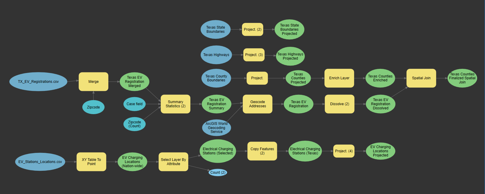

<h1>Electrical Vehicle Charging Stations in Texas</h1>

---
<h2> Model Workflows</h2>

<h3>County & Electrical Vehicle Charging Station Georeferencing Tool</h3>

Check out <a href="https://haxel491.github.io/Texas_EV_Stations/Images/Cost_Allocation_Tool.PNG" target="_blank" rel="noopener noreferrer">freeCodeCamp</a>.

<h3>Cost Allocation Determination Tool</h3>

<h3>Theissen Polygon Creation Tool</h3>

---
<h2>Map of Electrical Vehicle Charging Stations in Texas</h2>

---
