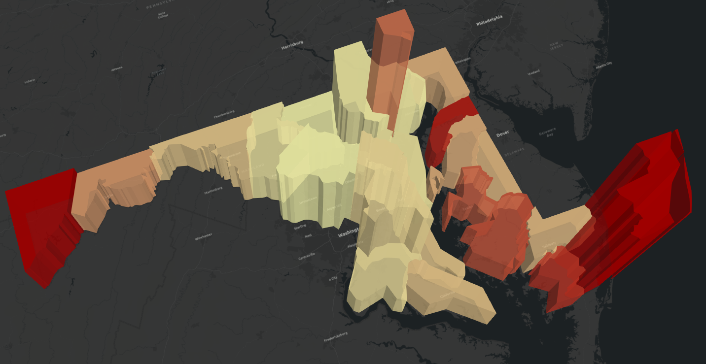

## Portfolio

---

### U.S. Presidential Elections
[2000 U.S. Presidental Election Results](US_Elections/Presidential/2000/index.md)

[2004 U.S. Presidental Election Results](US_Elections/Presidential/2004/index.md)

[2008 U.S. Presidental Election Results](US_Elections/Presidential/2006/index.md)

[2012 U.S. Presidental Election Results](US_Elections/Presidential/2012/index.md)

[2016 U.S. Presidental Election Results](US_Elections/Presidential/2016/Web_Map/index.html)

---
### Analyzing Vacant Households in Maryland with 3D Maps
[Vacant Households in the U.S.](/Vacant_Houses_Project/index.html)

---
[Project 3 Title](http://example.com/)

---

### Category Name 2

- [Project 1 Title](http://example.com/)
- [Project 2 Title](http://example.com/)
- [Project 3 Title](http://example.com/)
- [Project 4 Title](http://example.com/)
- [Project 5 Title](http://example.com/)

---

---

Page template forked from <a href="https://github.com/evanca/quick-portfolio">evanca</a>

<!-- Remove above link if you don't want to attibute -->
