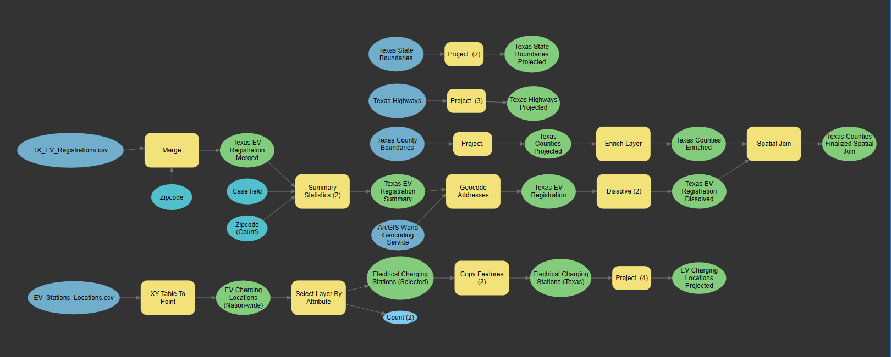

## Portfolio
---
### [Electrical Vehicle Stations in Texas](Texas_EV_Stations/index.md)
Detecting spatial autocorrelation and predicting distribution trends of electrical vehicle charging stations in Texas

---

### Online GIS Web Maps
<dl>
 <dt><h3><a href="https://dcdrones123.carto.com/builder/734c9c1c-2560-42f0-b42a-049a64320b2b/embed" target="_blank" rel="noopener noreferrer">2020 U.S. Presidential Election Results</a></h3></dt>
 <dd>- Combining ArcGIS Online, Mapbox, and CARTO to Create a GIS Web Map</dd>
 
 <dt><h3><a href="https://haxel491.github.io/US_Elections/Presidential/2016/Web_Map/index.html" target="_blank" rel="noopener noreferrer">2016 U.S. Presidential Election Results</a></h3></dt>
 <dd>- Creating a Custom Web with ESRI's REST Server, ArcGIS JavaScript API, and Dojo's Digit Containers</dd>
 
 <dt><h3><a href="https://haxel491.github.io/Vacant_Houses_Project/index.html" target="_blank" rel="noopener noreferrer">Exploring the Number of Vacant Homes in Maryland</a></h3></dt>
 <dd>- Using the ArcGIS JavaScript API to build a 3D web map</dd>
 </dl>
---

---

