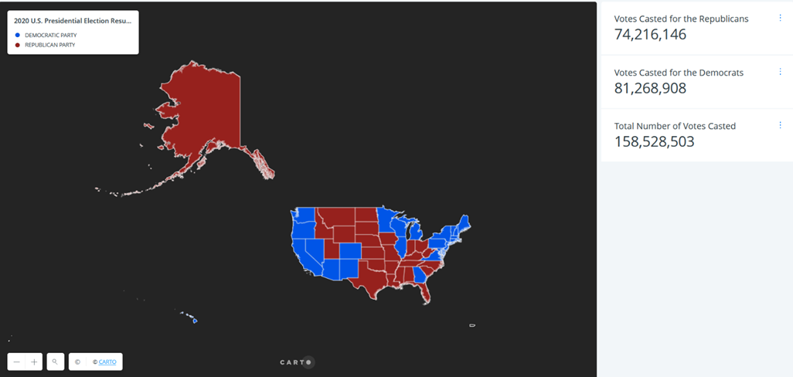

## Portfolio
---
### [Electrical Vehicle Stations in Texas](Texas_EV_Stations/index.md)
Detecting spatial autocorrelation and predicting distribution trends of electrical vehicle charging stations in Texas

---

### [2020 U.S. Presidental Election Results](/Vacant_Houses_Project/index.html)
Combining ArcGIS Online, Mapbox, and CARTO to created a GIS Web Application

---

### [2016 U.S. Presidental Election Results](US_Elections/Presidential/2016/Web_Map/index.html)
Creating ArcGIS Online Applications through ESRI's REST Server

 

---

### [Vacant Households in Maryland](/Vacant_Houses_Project/index.html)
Using the ArcGIS JavaScript API to build 3D web maps

---

---

